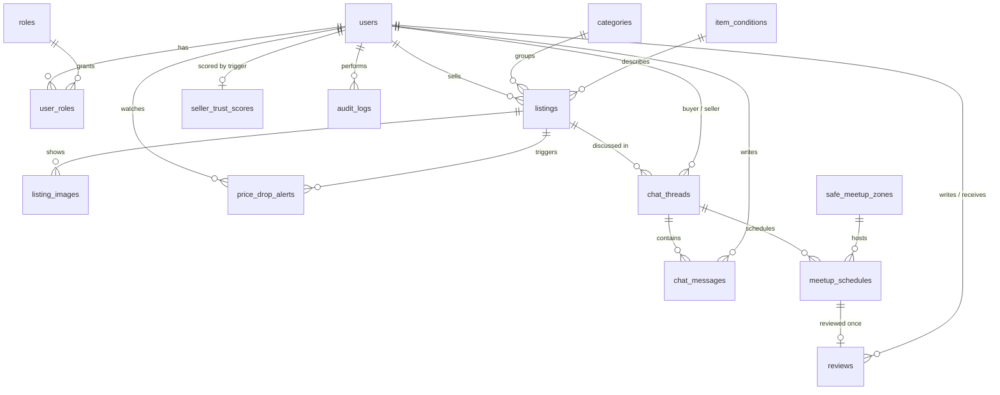

# BentaHub ER Diagram (15 tables)

Renders automatically on GitHub. For a PNG, paste `bentahub_er_diagram.txt` into dbdiagram.io.

```mermaid
erDiagram
    users ||--o{ user_roles : has
    roles ||--o{ user_roles : grants
    users ||--o{ listings : sells
    categories ||--o{ listings : groups
    item_conditions ||--o{ listings : describes
    listings ||--o{ listing_images : shows
    users ||--o{ price_drop_alerts : watches
    listings ||--o{ price_drop_alerts : triggers
    listings ||--o{ chat_threads : "discussed in"
    users ||--o{ chat_threads : "buyer / seller"
    chat_threads ||--o{ chat_messages : contains
    users ||--o{ chat_messages : writes
    chat_threads ||--o{ meetup_schedules : schedules
    safe_meetup_zones ||--o{ meetup_schedules : hosts
    meetup_schedules ||--o| reviews : "reviewed once"
    users ||--o{ reviews : "writes / receives"
    users ||--o| seller_trust_scores : "scored by trigger"
    users ||--o{ audit_logs : performs
```
